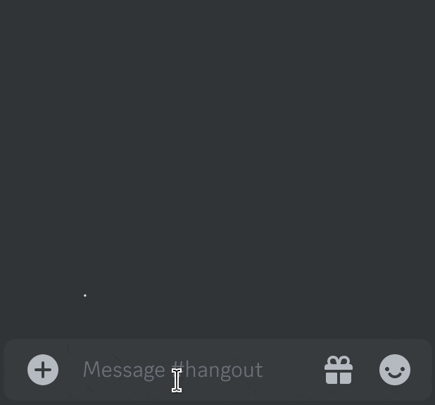

<div align="center">
<h1><a href="https://www.angelajfisher.com/projects/meeting-mate">Meeting Mate</a></h1>

Connect your Discord server with your Zoom meetings!

 [](https://developers.zoom.us/docs/api/meetings/events) [](https://discord.com/developers/docs/reference#api-versioning)  [](https://opensource.org/licenses/Apache-2.0)

</div>

---

Meeting Mate is a lightweight Discord bot that connects teams together by syncing the status of a Zoom meeting to a channel in a Discord server.

When the bot is active and commanded to watch a given Zoom meeting, it will post real-time updates to the Discord channel with the status of the meeting and the list of participants.

<div align="center">

</div>

<h2>Table of Contents</h2>

- [Getting Started](#getting-started)
  - [Requirements](#requirements)
  - [Environment Variables](#environment-variables)
    - [Required Variables](#required-variables)
  - [Installation](#installation)
    - [Installing from Source](#installing-from-source)
  - [Usage](#usage)
    - [Runtime Flags](#runtime-flags)
- [How It Works](#how-it-works)
  - [Zoom Webhook Listener](#zoom-webhook-listener)
  - [Discord API Integration](#discord-api-integration)
- [Development](#development)
- [Contributing](#contributing)


## Getting Started

Due to the security restrictions on the Zoom API, Meeting Mate can only connect to one Zoom account at a time. Therefore, to use the bot with your own meetings and servers, you must configure your own instance of Meeting Mate to connect to your accounts.

### Requirements

To set up your own Meeting Mate, you must have the following in place before beginning the installation:

1. A system that can satisfy Zoom's [webhook endpoint requirements](https://developers.zoom.us/docs/api/rest/webhook-reference/#webhook-endpoint-requirements)
2. Admin access to the Zoom account hosting the meetings you wish to sync with Discord
3. Ability to create a [webhook-only app](https://developers.zoom.us/docs/api/rest/webhook-only-app/) for the relevant Zoom account in the Zoom App Marketplace
4. Ability to create a [Discord app](https://discord.com/developers/docs/quick-start/getting-started#step-1-creating-an-app) to provide the bot with credentials

If you don't already have a host that satisfies Zoom's requirements, I recommend setting up a VPS for your Meeting Mate app. [Dreams of Code](https://www.youtube.com/@dreamsofcode) has [a good tutorial](https://www.youtube.com/watch?v=F-9KWQByeU0) for this.

<div align="right"><a href="#table-of-contents">↑ Back to top ↑</a></div>

### Environment Variables

Meeting Mate requires some environment variables in order to function. Two options are available to provide them to the program:

1. Build from source with the necessary environment variables in the terminal environment (recommended!)
2. Supply the file path to a `.env` file with the necessary environment variables enclosed at run time

#### Required Variables

> This list can also be found in the provided `.env.sample` file for ease of reference

- `ZOOM_TOKEN`: The secret token from your Zoom app
- `BOT_TOKEN`: The token key for your Discord bot
- `APP_ID`: Your Discord bot's application ID

When running in production, the following variables are also required:
- `SSL_CERT`: The file path to your FQDN's SSL certificate
- `SSL_KEY`: The file path to your FQDN's SSL key

<div align="right"><a href="#table-of-contents">↑ Back to top ↑</a></div>

### Installation

> Note: Before beginning the installation, ensure you meet the [requirements](#requirements) for running your own Meeting Mate.

1. Set up your Zoom app with the `meeting_end`, `participant_joined`, and `participant_left` webhook events enabled
2. Set up your Discord app and grab its token and app ID
3. Configure the [environment variables](#environment-variables) to be accessed by Meeting Mate
4. If installing from source, follow the [instructions below](#installing-from-source)
5. Run the binary with `./meeting-mate <your flags here>` (see the [list of runtime flags](#runtime-flags))

#### Installing from Source

To install Meeting Mate from its source, you will need [Go 1.22](https://go.dev/doc/install) or higher installed on your system.

Before building, consider the required environment variables and decide whether to include them in the environment or through a `.env` file. It is strongly recommended to include them in the environment at build time for increased security; however, they can be overwritten by a supplied `.env` file at runtime if needed.

Clone the git repository and `cd` into the project's root directory to run the build command:

```
go build -o ./meeting-mate ./cmd/meeting-mate
```

Alternatively, you can run `go install ./cmd/meeting-mate` to build the binary directly into your `$GOPATH`. This provides easy access to the program by name, `meeting-mate`, instead of having to execute the binary from a specific folder each time.

Once it's successfully compiled, run the binary with `./meeting-mate` if built or `meeting-mate` if installed and optionally add [flags](#runtime-flags).

<div align="right"><a href="#table-of-contents">↑ Back to top ↑</a></div>

### Usage

Meeting Mate has been designed with simplicity in mind for a smoother, more reliable operation. Simply add the bot to your Discord server, then begin watching a Zoom meeting with the command `/watch meeting_ID: <your Zoom meeting ID>` in your channel of choice. The bot will take care of the rest! Until it receives the `/cancel` command or the bot shuts down, it will continuously listen to Zoom webhooks and provide real-time status updates in Discord for the requested meeting(s).

<div align="right"><a href="#table-of-contents">↑ Back to top ↑</a></div>

#### Runtime Flags

- `--dev`: Runs the program in development mode, which disables TLS and prevents validation of webhook data source
- `--envFile`: Provides the program with the path of a `.env` file to source environment variables from -- overrides build time values
- `--webhookPort`: Port at which the webhook listener will listen for incoming Zoom correspondence

<div align="right"><a href="#table-of-contents">↑ Back to top ↑</a></div>

## How It Works

There are two main parts to Meeting Mate: the Zoom webhook listener and the integration with the Discord API. These two processes work together to collect, parse, and distribute the Zoom meeting data, united by an orchestrator.

### Zoom Webhook Listener

The webhook listener is a simple HTTP server that accepts JSON data from Zoom's servers.

When a meeting watch is active, the server will take incoming meeting data and send the relevant updates to the orchestrator to be formatted into data used by the bot process to send a Discord message. If there is no meeting watch active, it will toss the incoming data.

The Zoom API documentation for meeting webhooks can be referenced [here](https://developers.zoom.us/docs/api/rest/reference/zoom-api/events/).

<div align="right"><a href="#table-of-contents">↑ Back to top ↑</a></div>

### Discord API Integration

Integration with the Discord API is achieved thanks to the [discordgo package](https://github.com/bwmarrin/discordgo).

Meeting Mate has two primary commands: `/watch`, which instructs the program to begin listening to Zoom updates for a given meeting, and `/cancel`, which halts the tracking of further updates.

When a meeting watch is in progress, the bot will create a new message in the Discord channel when the meeting begins and continue to update the message as participants come and go. Once the meeting ends, the message is updated accordingly and is no longer stored. Instead, when the meeting begins again, a new message is sent to the channel.

If the program shuts down or a user instructs the bot to cancel the watch, any in-progress meeting messages are updated to notify users of their interruption.

<div align="right"><a href="#table-of-contents">↑ Back to top ↑</a></div>

## Development

For ease of development, [Docker](https://www.docker.com/) is the recommended way to run a development build of Meeting Mate. The Docker setup includes Air, which will automatically recompile and run the binary upon changes to the code.

To run the development build with Docker, simply run `docker compose up` from within the project's root directory on your local machine.

If you do not wish to use Docker, see the instructions for [building from source](#installing-from-source) and run the binary with the `--dev` [flag](#runtime-flags).

<div align="right"><a href="#table-of-contents">↑ Back to top ↑</a></div>

## Contributing

Thank you so much for your interest in contributing to Meeting Mate! At this time, I am not open to outside code contributions; however, feedback is welcomed and very much appreciated.

If you discover a bug, wish for a new feature, or have other ideas for ways Meeting Mate could grow to better serve your community, please let me know by opening a detailed issue so I can take a look.

<div align="right"><a href="#table-of-contents">↑ Back to top ↑</a></div>
